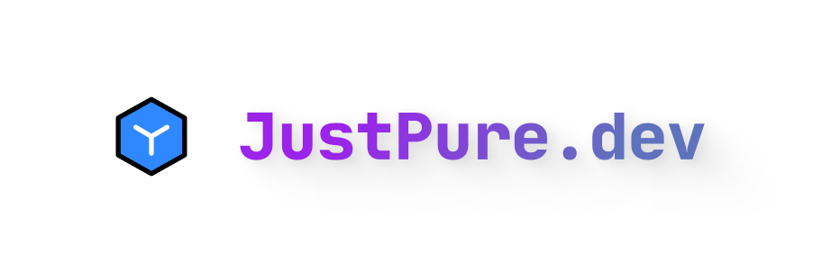

一个现代化，美观简洁高效的浏览器起始页，使用 Next.js 构建

---

## 特性

- 美观简洁的 UI 设计，支持暗黑模式
- 使用 Next.js 构建，支持服务端渲染
- 使用 TypeScript 编写，类型安全
- 使用 Shadcn-ui 组件库，支持主题定制

## 预览

[在线预览](https://justpure.dev)

## 截图


## 参与开发

```bash
# 克隆项目
git clone https://github.com/grtsinry43/pure-start.git

# 进入项目目录
cd pure-start

# 安装依赖
pnpm install

# 启动项目
pnpm dev
```

## 感谢

- [Next.js](https://nextjs.org)
- [Shadcn-ui](https://ui.shadcn.com/)
- [Vercel](https://vercel.com)
- [开放Bing APi](https://bing.img.run/api.html)

## 更多

此项目正处于早期开发阶段，欢迎提出建议和贡献代码

**License: MIT**

**Feel free to use it! Feel free to contribute!**
